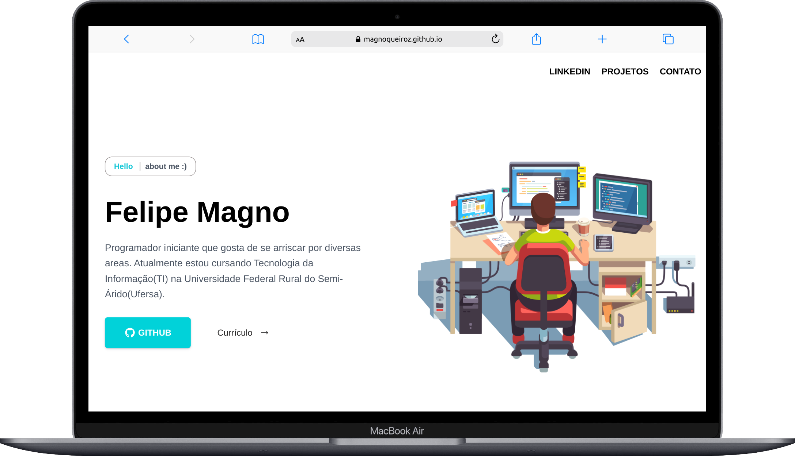
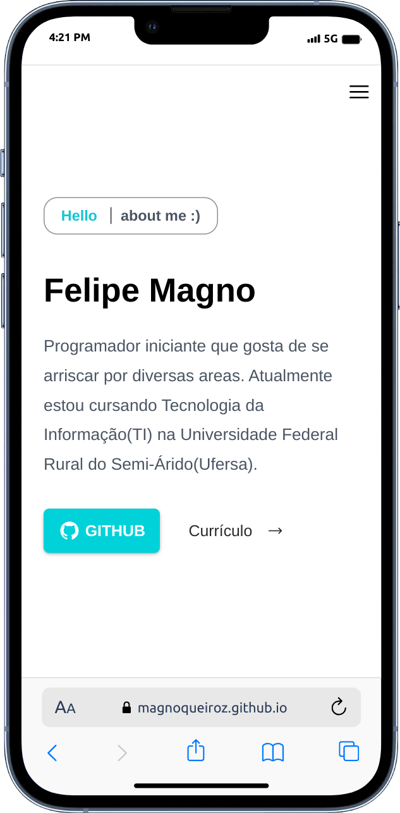

# Portfolio

Portfolio desenvolvido com as três estruturas básicas:

 &nbsp;
 &nbsp;
 &nbsp;

## Desktop and Mobile Version:

    
    

## Link:
<a href="https://magnoqueiroz.github.io/Portifolio/" target="_blank">Go Portfolio</a>
